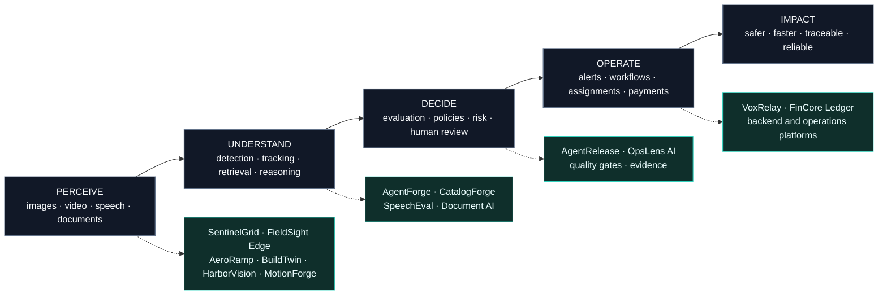

<div align="center">

# Husnain Munawar

**AI Engineer · Computer Vision Engineer · Production AI Systems**

`I build AI systems that move from perception to decision to real-world action.`

[](https://github.com/HUSNAIN-MUNAWAR)
[](mailto:husnainbinmunawar@gmail.com)

</div>

```text
husnain@devbox:~$ profile

role        AI Engineer / Computer Vision Engineer
focus       visual intelligence · agentic AI · production platforms
approach    research-driven · systems-first · evidence-based
mission     make AI useful, measurable and reliable
```

---

## The idea behind my work

My repositories are not isolated demos. Together, they form one engineering direction:

> **Sense the environment → understand what is happening → support a decision → automate the operation**



---

## Repository atlas

<table>
<tr>
<td width="33%" valign="top">

### Perception systems

- **SentinelGrid** — multi-camera safety intelligence
- **FieldSight Edge** — industrial inspection
- **AeroRamp Vision** — airport ramp safety
- **BuildTwin Vision** — construction intelligence
- **HarborVision Twin** — port operations
- **MotionForge 3D** — movement intelligence

</td>
<td width="33%" valign="top">

### Intelligence systems

- **AgentForge Studio** — agent operations
- **AgentRelease** — AI release gates
- **CatalogForge AI** — multimodal intake
- **OpsLens AI** — operational intelligence
- **SpeechEval** — TTS evaluation
- **Document AI** — extraction and validation

</td>
<td width="33%" valign="top">

### Operational platforms

- **VoxRelay AI** — voice operations
- **FinCore Ledger** — wallet and payments
- **Edge AI Systems** — efficient inference
- **Backend Platforms** — APIs and queues
- **Evaluation Systems** — quality and safety
- **Observability** — metrics and audit trails

</td>
</tr>
</table>

---

## What ties everything together

```text
MODEL OUTPUT
     │
     ▼
EVIDENCE + CONTEXT
     │
     ▼
RULES + EVALUATION
     │
     ▼
HUMAN OR AUTOMATED DECISION
     │
     ▼
TRACEABLE OPERATION
```

Every serious system I build aims to include:

`real data` · `evaluation` · `auditability` · `operator workflows` · `deployment`

---

## Engineering stack

<div align="center">


</div>

---

<div align="center">

### Build less noise. Ship more proof.

`research → system design → implementation → evaluation → deployment`

</div>
