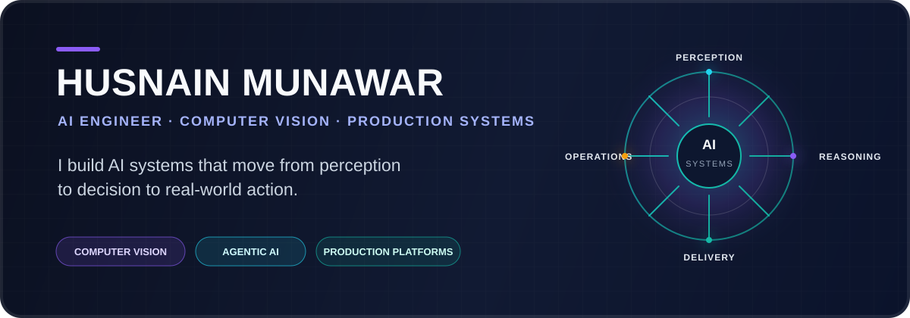
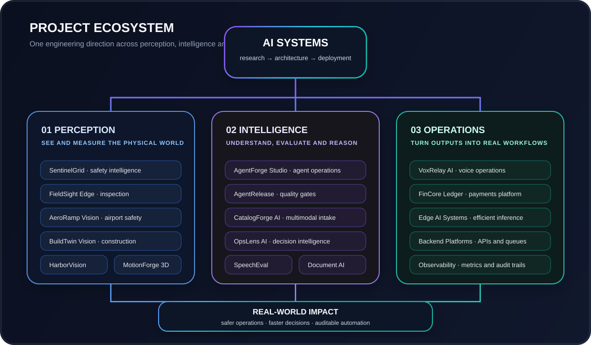
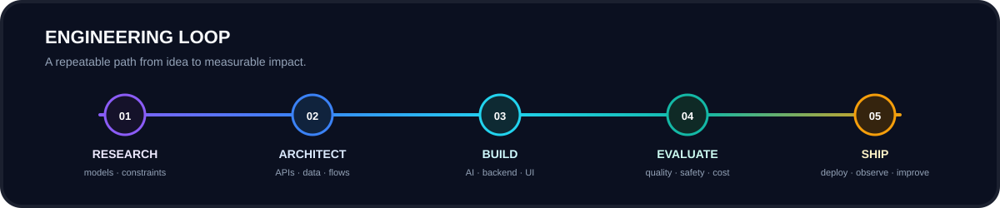

<div align="center">



<br/>

[](https://github.com/HUSNAIN-MUNAWAR)
[](mailto:husnainbinmunawar@gmail.com)


</div>

<br/>

```text
husnain@devbox:~$ profile

role        AI Engineer / Computer Vision Engineer
focus       visual intelligence · agentic AI · production platforms
approach    research-driven · systems-first · evidence-based
mission     make AI useful, measurable and reliable
```

## What connects my work

My repositories are not isolated experiments. They are parts of one engineering direction:

> **Sense the environment → understand what is happening → support a decision → execute a traceable operation**



## Engineering signature

<table>
<tr>
<td width="33%" valign="top">

### Evidence before claims

I design systems around measurable outputs, evaluation, evidence capture, review workflows and audit trails.

</td>
<td width="33%" valign="top">

### Product before demo

Model outputs are connected to APIs, databases, dashboards, queues, alerts and real operator actions.

</td>
<td width="33%" valign="top">

### Reliability by design

Testing, Docker, CI/CD, observability and reproducible data are treated as product features—not afterthoughts.

</td>
</tr>
</table>



## Core capabilities

| Area | What I build |
|---|---|
| **Computer Vision** | Detection, tracking, OCR, inspection, video intelligence and evidence pipelines |
| **Agentic AI** | Tool-using agents, RAG, evaluation, policy controls and human approval workflows |
| **Backend Systems** | FastAPI services, PostgreSQL models, Redis queues, authentication and auditability |
| **Operations Software** | Next.js dashboards, alerts, assignments, review queues and reporting |
| **Production Delivery** | Docker, CI/CD, tests, observability, runbooks and reproducible demonstrations |

## Technology layer

<div align="center">


</div>

<br/>

<div align="center">

### Build less noise. Ship more proof.

`research → architecture → implementation → evaluation → deployment`

</div>
