<div align="center">

# `HUSNAIN-MUNAWAR`

### AI Engineer · Computer Vision · Production AI


</div>

```text
╭──────────────────────────────────────────────────────────────────────────────╮
│                                                                              │
│   ██╗  ██╗███╗   ███╗        husnain@github:~$ ./mission                     │
│   ██║  ██║████╗ ████║                                                        │
│   ███████║██╔████╔██║        BUILD AI THAT CAN                               │
│   ██╔══██║██║╚██╔╝██║        SEE · REASON · OPERATE · SHIP                   │
│   ██║  ██║██║ ╚═╝ ██║                                                        │
│   ╚═╝  ╚═╝╚═╝     ╚═╝        From research idea → reliable product           │
│                                                                              │
╰──────────────────────────────────────────────────────────────────────────────╯
```

<div align="center">

## My work in one line

**I turn AI research into production systems that understand the world, support decisions, and improve real operations.**

</div>

---

## `SYSTEM CAPABILITIES`

<table>
<tr>
<td align="center" width="25%">
<h3>👁️ SEE</h3>
<sub>Detection<br>Tracking<br>OCR<br>Inspection<br>Video Intelligence</sub>
</td>
<td align="center" width="25%">
<h3>🧠 REASON</h3>
<sub>Agents<br>RAG<br>Evaluation<br>Policies<br>Human Oversight</sub>
</td>
<td align="center" width="25%">
<h3>⚙️ OPERATE</h3>
<sub>APIs<br>Queues<br>Dashboards<br>Audit Trails<br>Observability</sub>
</td>
<td align="center" width="25%">
<h3>🚀 SHIP</h3>
<sub>Testing<br>Docker<br>CI/CD<br>Documentation<br>Reproducible Demos</sub>
</td>
</tr>
</table>

---

## `PROJECT CONSTELLATION`

```mermaid
flowchart TB
    CORE(("HUSNAIN<br/>AI SYSTEMS"))

    CORE --> VISION
    CORE --> INTELLIGENCE
    CORE --> PLATFORM

    subgraph VISION["VISION + PHYSICAL WORLD"]
        direction TB
        SG["SentinelGrid<br/><small>Multi-camera safety intelligence</small>"]
        FS["FieldSight Edge<br/><small>Industrial inspection</small>"]
        AR["AeroRamp Vision<br/><small>Airport ramp safety</small>"]
        BT["BuildTwin Vision<br/><small>4D construction intelligence</small>"]
        HV["HarborVision Twin<br/><small>Port operations intelligence</small>"]
        MF["MotionForge 3D<br/><small>Human movement intelligence</small>"]
    end

    subgraph INTELLIGENCE["AGENTS + DECISION INTELLIGENCE"]
        direction TB
        AF["AgentForge Studio<br/><small>Agent workflow operations</small>"]
        AG["AgentRelease<br/><small>Evaluation and release gates</small>"]
        OL["OpsLens AI<br/><small>Retail and ERP intelligence</small>"]
        CF["CatalogForge AI<br/><small>Multimodal catalog automation</small>"]
        VR["VoxRelay AI<br/><small>Voice operations platform</small>"]
    end

    subgraph PLATFORM["PLATFORMS + RELIABLE DELIVERY"]
        direction TB
        FC["FinCore Ledger<br/><small>Wallet and payments platform</small>"]
        SE["SpeechEval<br/><small>TTS evaluation framework</small>"]
        EP["Edge AI Systems<br/><small>Efficient inference pipelines</small>"]
        BE["Backend Platforms<br/><small>APIs, queues and observability</small>"]
    end

    VISION --> IMPACT
    INTELLIGENCE --> IMPACT
    PLATFORM --> IMPACT

    IMPACT(["REAL-WORLD IMPACT<br/><small>Safer operations · Better decisions · Reliable automation</small>"])

    classDef core fill:#111827,stroke:#8B5CF6,color:#FFFFFF,stroke-width:3px;
    classDef vision fill:#172554,stroke:#60A5FA,color:#EAF2FF,stroke-width:1.5px;
    classDef intelligence fill:#3F2A14,stroke:#F4A261,color:#FFF4E6,stroke-width:1.5px;
    classDef platform fill:#123B35,stroke:#2A9D8F,color:#E8FFF9,stroke-width:1.5px;
    classDef impact fill:#3B1720,stroke:#F87171,color:#FFF1F2,stroke-width:2px;

    class CORE core;
    class SG,FS,AR,BT,HV,MF vision;
    class AF,AG,OL,CF,VR intelligence;
    class FC,SE,EP,BE platform;
    class IMPACT impact;

    style VISION fill:#0F172A,stroke:#3B82F6,stroke-width:2px,color:#DBEAFE
    style INTELLIGENCE fill:#1C1917,stroke:#F59E0B,stroke-width:2px,color:#FEF3C7
    style PLATFORM fill:#0F1F1C,stroke:#14B8A6,stroke-width:2px,color:#CCFBF1
```



---

## `HOW THE WORK CREATES VALUE`

```mermaid
flowchart LR
    R["Research<br/><small>models · papers · experiments</small>"]
    A["Architecture<br/><small>APIs · data · workflows</small>"]
    B["Build<br/><small>backend · frontend · AI</small>"]
    E["Evaluate<br/><small>quality · safety · latency</small>"]
    D["Deploy<br/><small>Docker · CI/CD · monitoring</small>"]
    I["Impact<br/><small>decisions · safety · automation</small>"]

    R --> A --> B --> E --> D --> I

    classDef research fill:#312E81,stroke:#818CF8,color:#EEF2FF,stroke-width:2px;
    classDef architecture fill:#164E63,stroke:#22D3EE,color:#ECFEFF,stroke-width:2px;
    classDef build fill:#14532D,stroke:#4ADE80,color:#F0FDF4,stroke-width:2px;
    classDef evaluate fill:#713F12,stroke:#FACC15,color:#FEFCE8,stroke-width:2px;
    classDef deploy fill:#7C2D12,stroke:#FB923C,color:#FFF7ED,stroke-width:2px;
    classDef impact fill:#701A75,stroke:#E879F9,color:#FDF4FF,stroke-width:2px;

    class R research;
    class A architecture;
    class B build;
    class E evaluate;
    class D deploy;
    class I impact;
```



---

## `IMPACT MAP`

| Domain | What the systems do |
|---|---|
| 🟣 **Industrial Vision** | Detect defects, track events, capture evidence, and support human review |
| 🔵 **Safety Intelligence** | Monitor environments, identify risk, and create auditable incident workflows |
| 🟠 **Agentic AI** | Orchestrate tools, enforce policies, evaluate outputs, and keep humans in control |
| 🟢 **Operations Software** | Convert model outputs into dashboards, alerts, assignments, and decisions |
| 🔴 **Platform Engineering** | Make AI products testable, observable, containerized, and production-ready |

---

## `ENGINEERING DNA`

<div align="center">


</div>

---

## `OPERATING PRINCIPLE`

```text
┌──────────────────────────────────────────────────────────────────────────────┐
│  Build useful systems.                                                       │
│  Measure their behavior.                                                     │
│  Make them reliable.                                                         │
└──────────────────────────────────────────────────────────────────────────────┘
```

<div align="center">

[](https://github.com/HUSNAIN-MUNAWAR)
[](mailto:husnainbinmunawar@gmail.com)

```text
husnain@devbox:~$ ship --useful --measurable --reliable
```

</div>
